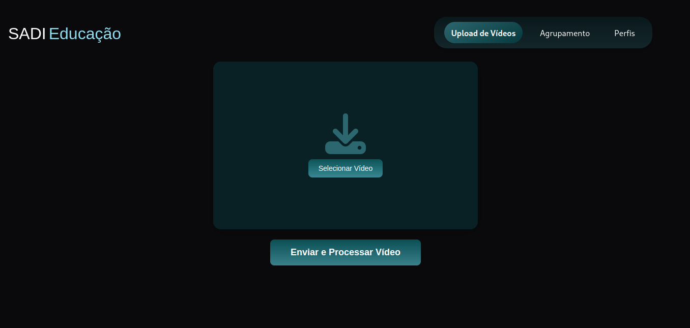
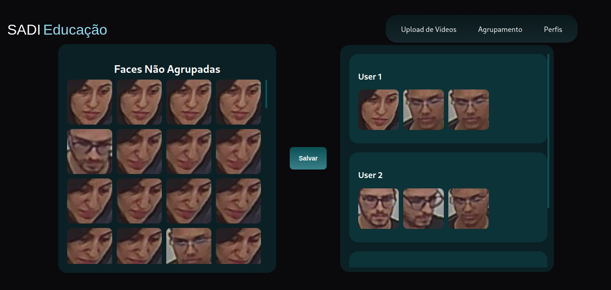
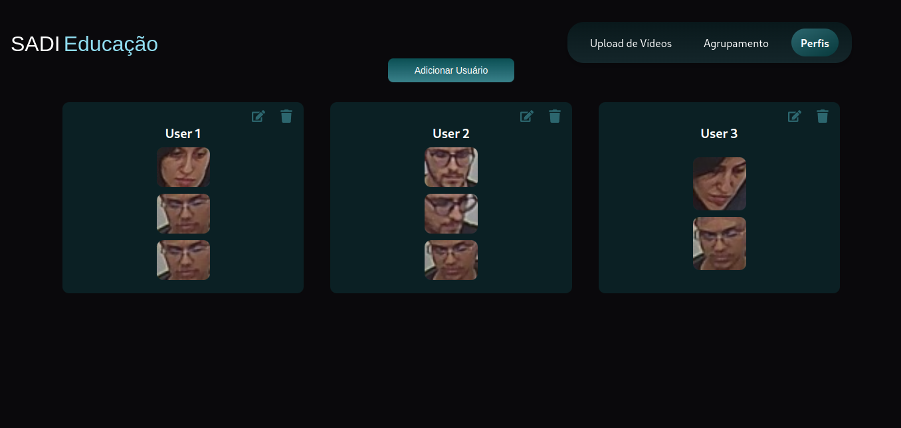

# Processamento de Vídeos com Agrupamento de Faces

Este projeto consiste em uma aplicação Django para processamento de vídeos, detecção de faces e agrupamento. O sistema permite o upload de vídeos, detecta faces, organiza as faces em perfis e possibilita o agrupamento manual.

## Funcionalidades

- Upload de vídeos.
- Detecção de faces nos vídeos.
- Agrupamento das faces em perfis de usuários.
- Agrupamento manual.
- Interface interativa para facilitar o processo.

## Tecnologias Utilizadas

- **Backend**: Django
- **Processamento de Vídeo**: OpenCV, face_recognition, dlib
- **Banco de Dados**: MySQL
- **Processamento Assíncrono**: Celery
- **Frontend**: React
- **API**: RESTful APIs com Django Rest Framework

## Instalação e Configuração

### Backend

1. Clone este repositório:
   ```bash
   git clone https://github.com/Poliih/ComputerVision.git
   cd ComputerVision
   ```

2. Instale as dependências:
   ```bash
   pip install -r requirements.txt
   ```

3. Configure o banco de dados no arquivo `settings.py` do Django em:
   ```bash
   DATABASES
   ```

4. Execute as migrações:
   ```bash
   python manage.py migrate
   ```

5. Inicie o servidor:
   ```bash
   python manage.py runserver
   ```

6. Inicie o servidor Redis:
   ```bash
   redis-server
   ```

7. Inicie o servidor Celery:
   ```bash
   celery -A core worker --loglevel=info
   ```

### Frontend

1. Navegue até o diretório `frontend` (caso haja um diretório separado):
   ```bash
   cd frontend
   ```

2. Instale as dependências:
   ```bash
   npm install
   ```

3. Inicie o servidor de desenvolvimento:
   ```bash
   npm start
   ```

## Endpoints da API

### **Faces Não Agrupadas**
- **Endpoint**: `/api/video/faceslist/`
- **Método**: `GET`
- **Descrição**: Retorna uma lista de faces que ainda não estão associadas a um perfil.

### **Perfis de Usuário**
- **Endpoint**: `/api/user_profile/list_profiles_with_faces/`
- **Método**: `GET`
- **Descrição**: Retorna uma lista de perfis de usuário, com as faces associadas a cada perfil.

### **Associar Faces a um Perfil**
- **Endpoint**: `/api/user_profile/associate_faces_to_profile/`
- **Método**: `POST`
- **Descrição**: Associa faces selecionadas a um perfil de usuário. O corpo da requisição deve conter:
  ```json
  {
    "profile_id": "ID do perfil",
    "face_ids": ["IDs das faces"]
  }
  ```

### **Upload de Vídeo**
- **Endpoint**: `/api/video/upload/`
- **Método**: `POST`
- **Descrição**: Este endpoint permite o upload de um vídeo para o servidor.
- **Exemplo de corpo da requisição (form-data)**:
  - **Campo**: `video` (Arquivo de vídeo)
- **Exemplo de sucesso**:
  ```json
  {
    "status": "Processando vídeo",
    "video_id": 123
  }
  ```
- **Exemplo de erro** (caso o arquivo de vídeo não seja encontrado):
  ```json
  {
    "error": "Vídeo não encontrado"
  }
  ```

## Por:

Poliana Rodrigues da Silva

## Prints





